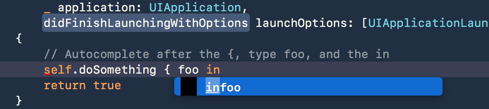

# IgnoreXcodeImageCompletions

IgnoreXcodeImageCompletions is an "old style" Xcode plugin for disabling
image autocompletion. Just in case you've ever been annoyed by this:

## Installation

1. [Un-sign Xcode][unsign]
1. Copy `IgnoreXcodeImageCompletions.xcplugin` to `~/Library/Application
   Support/Developer/Shared/Xcode/Plug-ins`
1. Celebrate

OR:

1. [Un-sign Xcode][unsign]
1. Clone the repo
1. Run `make install`

If you don't want to do this you should [dup my radar][radar] on this
silly autocompletion behavior.

### Compatibility

Currently this plugin has been tested with (and has the UUIDs for):

- Xcode 9.3 beta 4 (9Q127n)
- Xcode 9.2 (9C40b)
- Xcode 9.0 (9A235)
- Xcode 8.3.3 (8E3004b)

[radar]: http://www.openradar.me/33506212
[unsign]: https://github.com/XVimProject/XVim/blob/master/INSTALL_Xcode8.md
